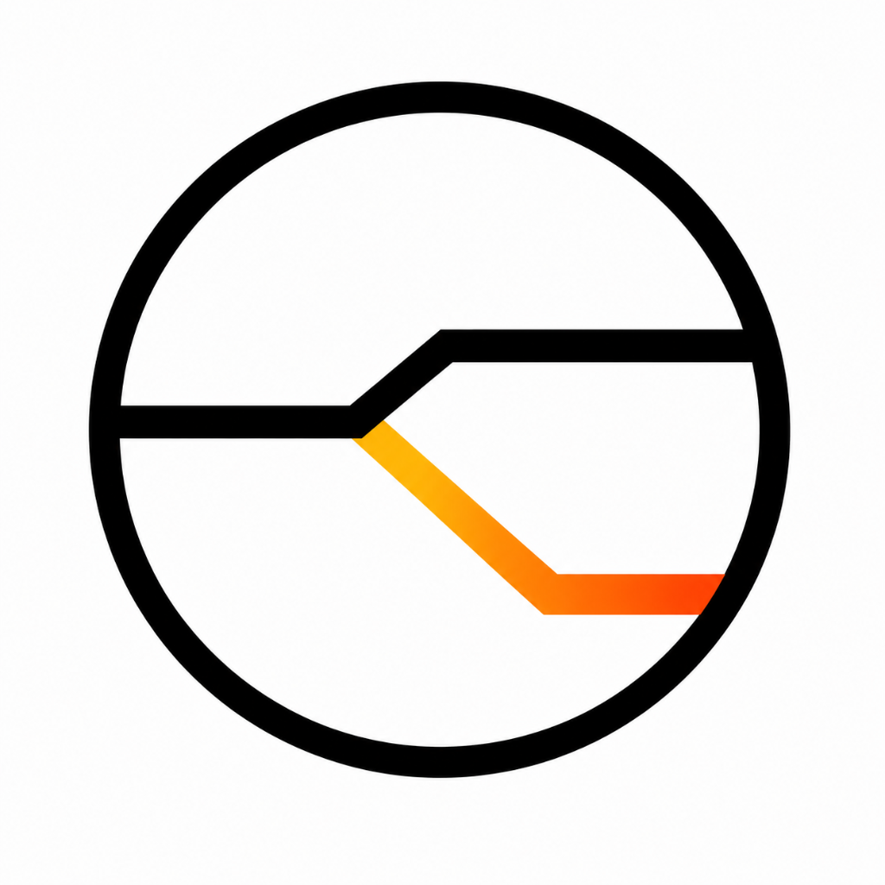

<p align="center">
  
</p>

<h1 align="center">DecisioLens</h1>

<p align="center">
  <strong>Test whether an AI decision was fair, without needing access to the AI.</strong>
</p>

<p align="center">
  <a href="LICENSE"></a>
  <a href="https://python.org"></a>
  <a href="https://fastapi.tiangolo.com"></a>
  <a href="https://nextjs.org"></a>
  <a href="https://aistudio.google.com"></a>
</p>

---

## Overview

AI systems decide who gets hired, who gets a loan, who gets admitted, who gets their insurance claim paid, and who qualifies for government benefits. Most of the time, the people affected by these decisions have no visibility into why they were rejected and no clear path to challenge the outcome.

DecisioLens is a simulation tool that tests how a decision behaves under small controlled changes. You enter a profile, set a threshold, and we run the numbers swapping gender, city, caste category, employment type, or age group, and show you whether the outcome holds up or falls apart.

If the decision flips when only gender changes, that is a problem worth knowing about.

> We don't need access to the original AI system. We build our own domain-specific scoring model, run the same logic across variation profiles, and surface the patterns. It's simulation-based auditing at the individual level, not aggregate dataset analysis.

---

## How It Works

```
Enter a profile
      |
Domain-specific scoring formula runs
      |
We test 9 different decision thresholds (0.1 to 0.9)
      |
We build 3-4 counterfactual clones (gender swap, city change, category change, etc.)
      |
We score and decide every clone
      |
We flag: outcome flips, suspicious score gaps, borderline zones
      |
Risk score (0-100) + confidence zone classification
      |
Gemini 2.5 Flash writes the explanation and appeal letter
```

Each step is a separate module. The two Gemini calls run in parallel using `asyncio.gather`.

---

## Domains

| Domain | Who It's For | Variables We Swap |
|---|---|---|
| Hiring | Job applicant rejected by an automated screener | Gender, city, college tier |
| Lending | Loan applicant denied by a credit AI | Gender, employment type, city |
| Education | Student rejected by a college admission system | Gender, city, caste category, income band |
| Health Insurance | Patient whose claim was auto-rejected | Age group, pre-existing condition, city tier |
| Govt. Welfare | Citizen denied PM-KISAN or similar schemes | Social category, region, gender |

Every domain has its own scoring formula where the demographic variables actually affect the output. The bias you detect is not manufactured. It reflects the kinds of penalties these systems apply in practice.

---

## What an Audit Returns

```json
{
  "original": { "score": 0.481, "decision": "REJECT", "threshold": 0.5 },
  "threshold_analysis": [ ... ],     // decision at each of 9 threshold points
  "variations": [ ... ],             // outcome for each counterfactual clone
  "insights": {
    "instability": true,
    "bias_detected": true,
    "risk_score": 72,
    "risk_level": "HIGH",
    "reason_tags": ["gender_sensitive", "threshold_sensitive"]
  },
  "human_review": {
    "level": "REQUIRED",             // REQUIRED / RECOMMENDED / NOT_REQUIRED
    "reason": "..."                  // plain-language justification
  },
  "recourse": [                      // concrete steps that could flip the decision
    { "action": "...", "impact": "..." }
  ],
  "explanation": "...",              // Gemini plain-language audit summary
  "appeal": "...",                   // Gemini formal appeal letter
  "explanation_request": "...",      // Gemini formal right-to-explanation letter
  "ai_jury_view": {
    "auditor": "bias detected (1 flag)",
    "challenger": "unstable",
    "judge": "high risk (score=72)"
  }
}
```

### Human Review Recommendation

Every audit ends with a human oversight recommendation based on three criteria:

| Level | Triggers When |
|---|---|
| REQUIRED | Risk score above 70, OR bias detected, OR confidence zone is Unstable |
| RECOMMENDED | Risk score above 35, OR any threshold or variation flips |
| NOT_REQUIRED | Decision is stable across all tests |

This is designed around regulatory expectations in the EU AI Act and India's DPDP Act, which require that high-risk automated decisions include a human review pathway.

### Actionable Recourse

Instead of just saying "this looks risky", DecisioLens tells you what you can actually do. For rejected decisions it generates:

- Which threshold level would have accepted the profile
- How much the primary score needs to improve to cross the threshold
- Which demographic variable to request a review of (when bias was detected)
- Whether to ask for human review (when instability or bias flags are present)

### Right-to-Explanation Letter

Alongside the appeal letter, DecisioLens generates a separate formal Right-to-Explanation request letter. This is grounded in data protection rights (GDPR Article 22, India DPDP Act) that entitle affected people to:

1. A clear explanation of the logic used
2. The main factors and their weights
3. Disclosure of whether human oversight was applied
4. The right to request human review
5. Details of data categories used

Both letters appear in the same card with a tab switcher. Each has a copy button so it can be sent directly.

---

## Real Example

**Profile:** Riya Shah | Score 66 | 3 years experience | Female | Mumbai | Tier 1 college

**Decision at threshold 0.50:** REJECT

| Variation | Score | Decision | Flipped? |
|---|---|---|---|
| Original (Riya) | 0.481 | REJECT | |
| Gender -> Male | 0.511 | ACCEPT | Yes |
| Location -> Nagpur | 0.441 | REJECT | No |
| College -> Tier 2 | 0.461 | REJECT | No |

Risk score: 72/100 (HIGH). The decision changes only when gender changes. That is the finding.

Gemini then writes: *"A male candidate with the same qualifications would have been accepted at this threshold. This is consistent with gender proxy bias and the applicant has grounds to request a manual review."*

---

## Architecture

```
decisiolens/
|-- backend/
|   |-- ai/gemini.py              Gemini 2.5 Flash, async, singleton, offline fallback
|   |-- core/
|   |   |-- model.py              5 domain-specific scoring formulas
|   |   |-- scenario.py           Counterfactual variation generator
|   |   |-- analysis.py           Instability and bias detection
|   |   |-- threshold.py          9-point sensitivity tester
|   |   |-- cache.py              LRU cache (256 slots, 5-min TTL)
|   |   `-- config.py             Pydantic settings via .env
|   |-- schemas/
|   |   |-- request.py            Flexible multi-domain input (extra="forbid")
|   |   `-- response.py           Typed AuditResponse
|   |-- services/audit_service.py Full pipeline orchestrator
|   `-- routers/audit.py          HTTP layer only
|
`-- frontend/
    `-- src/
        |-- features/
        |   |-- audit/            Input form and live results
        |   |-- results/          Verdict report (7 sections)
        |   |-- history/          Past audit sessions
        |   `-- batch/            CSV bulk testing
        `-- lib/domains/
            |-- hiring.ts
            |-- lending.ts
            |-- education.ts
            |-- insurance.ts
            `-- welfare.ts
```

---

## Quick Start

**Requirements:** Python 3.11+, Node.js 18+, a free [Google AI Studio](https://aistudio.google.com) API key.

**Backend**

```bash
cd backend
python -m venv venv && venv\Scripts\activate
pip install -r requirements.txt
echo GEMINI_API_KEY=your_key_here > .env
python -m uvicorn main:app --reload
```

API at `http://127.0.0.1:8000`. Swagger docs at `/docs`

**Frontend**

```bash
cd frontend
npm install
npm run dev
```

Open `http://localhost:3000`

---

## API

```
POST /audit/run
```

```json
{
  "domain": "hiring",
  "threshold": 0.5,
  "profile": {
    "name": "Riya Shah",
    "score": 66,
    "experience": 3,
    "gender": "Female",
    "location": "Mumbai",
    "college": "Tier 1"
  }
}
```

For other domains, send the fields that domain expects (age and claim_amount for insurance, annual_income and category for welfare, etc.). The backend schema accepts any profile shape.

```
GET /health  ->  { "status": "ok" }
```

---

## Tech Stack

| Layer | Technology |
|---|---|
| Frontend | Next.js 14, TypeScript, Tailwind CSS |
| Backend | Python 3.11, FastAPI, Pydantic v2, Uvicorn |
| AI | Google Gemini 2.5 Flash via google-genai SDK |
| Async | asyncio.gather for concurrent Gemini calls |
| Cache | In-memory LRU (256 slots, 5-minute TTL) |
| Logging | Structured JSON with request timing middleware |

---

## UN Sustainable Development Goals

SDG 10 (Reduced Inequalities) and SDG 16 (Justice and Strong Institutions) are the core. The other domains extend this: SDG 8 for hiring, SDG 4 for education, SDG 3 for health insurance, SDG 1 for welfare.

A single tool that touches six SDGs is only possible because the underlying problem is the same in every domain: an automated decision was made, a person was affected, and there was no accountability layer.

---

## What We're Building Next

- Deploy to Vercel (frontend) and Google Cloud Run (backend)
- Let users upload real AI predictions via CSV for external system testing
- Housing and rental application domain
- SHAP-style feature importance visualization
- Hindi, Gujarati, Tamil language support

---

## Google Solution Challenge 2026

Built for the Open Innovation track. The core idea is that AI fairness tools typically require model access, training data, or engineering knowledge. DecisioLens requires none of those. Just a profile and a decision. Anyone can use it.

---

## License

MIT. See [LICENSE](LICENSE).

---

*DecisioLens - Built for Google Solution Challenge 2026*
